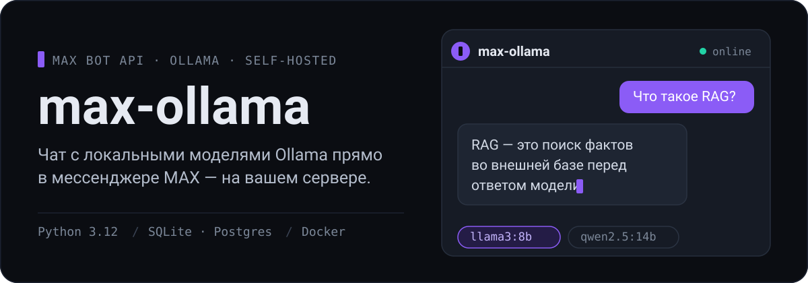
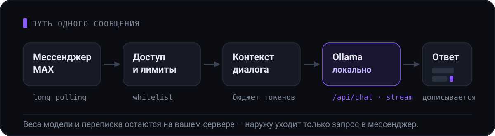

<p align="center">
  
</p>

<p align="center">
  <a href="https://github.com/Fgeeha/max-ollama/actions/workflows/ci.yml"></a>
  
  
  
</p>

Бот для мессенджера [MAX](https://max.ru), который отвечает локальными моделями
[Ollama](https://ollama.com). Модель крутится на вашей машине, история диалогов лежит
в вашей базе — наружу уходит только запрос в мессенджер.

Ответ приходит потоком: бот отправляет сообщение, как только накопились первые
символы, и дописывает его по мере генерации. Модель переключается кнопками, картинки
уходят в vision-модели, доступ ограничен списком разрешённых пользователей.

## Как это работает

<p align="center">
  
</p>

Три вещи, которые отличают этот бот от обёртки над API в пятьдесят строк:

- **Контекст считается в токенах, а не символах.** Старые ходы выпадают, когда история
  перестаёт помещаться в бюджет; последний обмен не выбрасывается никогда.
- **Длинные ответы не теряются.** Всё, что не влезает в лимит сообщения MAX,
  режется по границам абзацев и досылается следующими сообщениями.
- **Одна генерация не блокирует остальных.** События обрабатываются параллельно,
  у зависшей генерации есть таймаут, а `/stop` прерывает её вручную.

## Быстрый старт

Нужен Python 3.12+, запущенный Ollama с загруженными моделями и токен бота MAX
(бот создаётся через MasterBot, см. [документацию MAX Bot API](https://dev.max.ru/docs-api/)).

```bash
git clone https://github.com/Fgeeha/max-ollama && cd max-ollama
cp .env.example .env        # заполните MAX_BOT_TOKEN и ADMIN_ID
uv sync
uv run python -m bot.main
```

Через Docker:

```bash
cp .env.example .env
docker compose up -d
docker compose logs -f bot
```

Дальше напишите боту `/start`. Если `ADMIN_ID` ещё не известен — бот вернёт ваш
идентификатор прямо в ответе, подставьте его в `.env` и перезапустите.

> Ollama на хосте, а бот в контейнере? Укажите `OLLAMA_HOST=http://host.docker.internal:11434`,
> на Linux — адрес docker-моста, например `http://172.17.0.1:11434`.

## Команды

**Чат**

| Команда | Что делает |
|---|---|
| любое сообщение | Отправить запрос модели |
| изображение | Отправить картинку vision-модели, подпись становится промптом |
| `/stop` | Прервать текущую генерацию |
| `/system [текст]` | Свой системный промпт, `/system reset` — вернуть стандартный |
| `/clear` | Начать диалог с чистого листа |
| `/regenerate` | Перегенерировать последний ответ |
| `/history` | Последние 10 сообщений |

**Модели**

| Команда | Что делает |
|---|---|
| `/models` | Список моделей с выбором кнопками |
| `/switch_model <имя>` | Переключить модель |
| `/current_model` | Показать выбранную модель |
| `/model_info [имя]` | Параметры, квантизация, семейство, шаблон |

**Общие и админские**

| Команда | Что делает |
|---|---|
| `/start`, `/help`, `/status` | Регистрация, справка, состояние бота и Ollama |
| `/add_user <id>`, `/remove_user <id>` | Выдать и отозвать доступ |
| `/list_users` | Список пользователей |
| `/test_mode [on\|off]` | Режим «только админ», переживает рестарт |
| `/stats` | Статистика за 24 часа: запросы, токены, время ответа |
| `/clear_history <id\|all>` | Очистить историю |
| `/broadcast <текст>` | Рассылка активным пользователям |

## Конфигурация

Всё читается из `.env` или переменных окружения. Обязательны только первые две.

| Переменная | По умолчанию | Описание |
|---|---|---|
| `MAX_BOT_TOKEN` | — | Токен бота MAX |
| `ADMIN_ID` | — | MAX user id администратора |
| `OLLAMA_HOST` | `http://localhost:11434` | Адрес Ollama API |
| `DEFAULT_MODEL` | `llama2` | Модель для пользователей без выбора |
| `DATABASE_URL` | `sqlite:///data/bot.db` | SQLite или PostgreSQL |
| `MAX_CONTEXT_TOKENS` | `3000` | Бюджет истории в токенах (оценка, см. ниже) |
| `OLLAMA_TIMEOUT` | `60` | Таймаут обычных запросов, сек |
| `OLLAMA_STREAM_READ_TIMEOUT` | `120` | Максимальная пауза между чанками ответа, сек |
| `OLLAMA_GENERATION_TIMEOUT` | `600` | Предел на одну генерацию, сек |
| `OLLAMA_KEEP_ALIVE` | `10m` | Сколько Ollama держит модель загруженной |
| `OLLAMA_TEMPERATURE` | — | Температура; пусто — значение модели |
| `OLLAMA_NUM_CTX` | — | Размер окна контекста; пусто — значение модели |
| `TEST_MODE` | `false` | Отвечать только администратору |
| `RATE_LIMIT_MESSAGES` / `RATE_LIMIT_WINDOW` | `10` / `60` | Сообщений на окно, длина окна в секундах |
| `LOG_LEVEL` | `INFO` | DEBUG / INFO / WARNING / ERROR / CRITICAL |
| `HEALTH_CHECK_ENABLED` / `HEALTH_CHECK_PORT` | `true` / `8080` | HTTP health-сервер |

## Разработка

```bash
make install   # uv sync
make dev       # запуск бота
make test      # pytest с покрытием
make lint      # ruff + mypy
make migrate   # применить миграции
```

Схема версионируется alembic. База, созданная до появления миграций, распознаётся
и доводится до актуальной автоматически при запуске.

## Health check

```bash
curl http://localhost:8080/health
# {"status": "healthy", "bot": "online", "ollama": "online"}
```

Возвращает `503`, если Ollama недоступна. Этим же эндпоинтом пользуется
healthcheck в `docker-compose.yml`.

<details>
<summary><b>Устройство проекта</b></summary>

```
src/bot/
├── main.py            # запуск, инициализация, graceful shutdown
├── runtime.py         # общие Bot / Dispatcher / OllamaClient
├── config.py          # настройки (pydantic-settings)
├── decorators.py      # admin_only, authorized_only, rate_limited
├── database/          # модели, сессии и миграции SQLAlchemy (async)
├── handlers/          # common, admin, models, chat, errors
└── utils/
    ├── events.py      # нормализация MessageCreated / MessageCallback
    ├── context.py     # контекст диалога и бюджет токенов
    ├── ollama.py      # HTTP-клиент Ollama (chat, stream, vision, /api/show)
    ├── text.py        # нарезка длинных ответов
    ├── health.py      # /health (и /metrics — заглушка под Prometheus)
    └── logging.py     # structlog
```

Порядок регистрации хендлеров — это приоритет: MAX отдаёт событие **первому**
подходящему обработчику. Поэтому `handlers/__init__.py` импортирует модули в
порядке «команды → вложения → произвольный текст», и этот порядок закреплён тестом.

</details>

<details>
<summary><b>Как устроена работа с MAX</b></summary>

- **Хендлеры** регистрируются декораторами диспетчера: `@dp.message_created(Command("stats"))`,
  `@dp.message_callback(...)`, `@dp.bot_started()`. Аргументы команды приходят
  в хендлер kwarg-ом `args` от фильтра `Command`.
- **Общие объекты** (`Bot`, `Dispatcher`, `OllamaClient`) живут в `bot/runtime.py`:
  в MAX нет объекта-контекста, который прокидывается в каждый хендлер.
- **Два типа событий** — `MessageCreated` и `MessageCallback` — по-разному хранят
  автора и цель ответа. `bot/utils/events.py` приводит их к общему виду.
- **Inline-клавиатура** собирается через `InlineKeyboardBuilder` и отправляется
  как вложение. Выбор модели передаётся типизированным `CallbackPayload`.
- **Стриминг**: первое сообщение уходит примерно на 50 символах, дальше текст
  дописывается через `bot.edit_message` — не чаще раза в секунду и не чаще
  чем раз в 100 символов, чтобы не упереться в лимиты MAX на редактирование.
- **Изображения** приходят вложением с прямым URL; бот качает их через
  `bot.download_bytes(url)` и отдаёт модели в base64.
- **Бюджет контекста приблизительный.** Ollama не отдаёт токенизатор, а тянуть его
  под каждую модель — лишняя зависимость. Оценка намеренно завышает счёт: выбросить
  лишнее сообщение дешевле, чем недосчитать и получить молчаливое обрезание промпта
  внутри модели. Держите `MAX_CONTEXT_TOKENS` заметно ниже `num_ctx` модели.
- **HTML-разметка**: по хелперам форматирования maxapi это `<b>`, `<i>`, `<ins>`,
  `<s>`, `<code>`, `<h1>`, `<mark>`, `<blockquote>`, `<a>` — блочного `<pre>` нет,
  а подчёркивание это `<ins>`, а не `<u>`. Пользовательский текст экранируется.

</details>

<details>
<summary><b>Эксплуатация и CI/CD</b></summary>

- Чтобы бот получал сообщения в **групповом чате, ему нужны права администратора**
  чата — иначе события до него не доходят.
- Бот работает на **long polling**. Это проще в развёртывании, но MAX ограничивает
  скорость и срок хранения событий; для нагруженного продакшена в maxapi есть
  webhook (`dp.handle_webhook`), потребуется HTTPS и сертификат доверенного CA.
- Polling не получает события, если у бота остались активные webhook-подписки.
  Снять их: `await bot.delete_webhook()`.

`.github/workflows/ci.yml` запускается на push и pull request в `Master`, а также
на теги `v*`: сначала линтер и тесты, затем сборка образа и публикация в GitHub
Container Registry. На pull request образ только собирается. Теги образа: имя ветки,
`sha-<short>`, `latest` для `Master`, `X.Y.Z` и `X.Y` для тегов вида `v1.2.3`.

```bash
docker run -d --name max-ollama-bot \
  --env-file .env \
  -v "$PWD/data:/app/data" \
  ghcr.io/fgeeha/max-ollama:latest
```

</details>

## Лицензия

MIT
